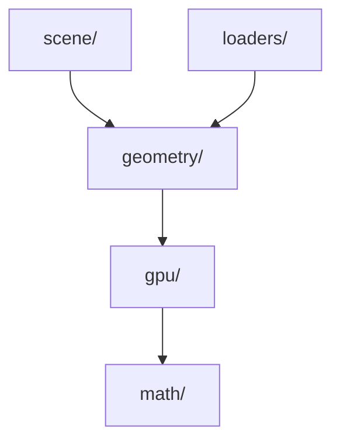
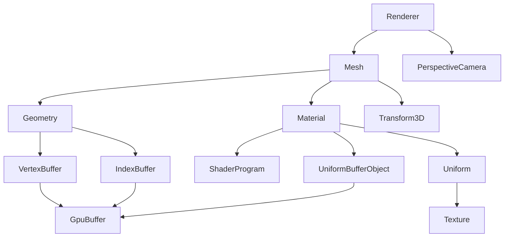
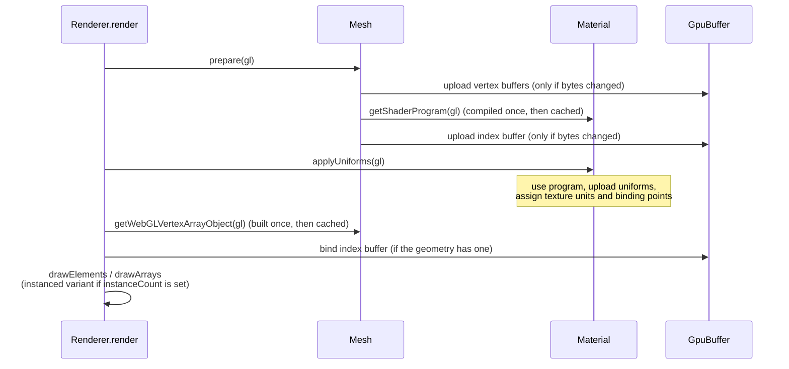

# Architecture

## Layers

Each folder is a layer; a layer only imports from layers below it (not
necessarily the one directly below — `math/` is available to everyone):

Inside those layers, the classes compose like this (an arrow means "uses"):

The two sides of a mesh mirror each other: `Geometry` gives meaning to GPU
buffers, and `Material` gives meaning to a shader program. `Mesh` pairs them,
and `Renderer` draws the pair.

- **math/** — pure values with no WebGL in them: `Vector2`, `Vector3`,
  `Quaternion`, `Matrix3`, `Matrix4`, `Transform2D`, `Transform3D`. A transform
  is scale + rotation + translation, and turns into a matrix on demand.
- **gpu/** — wrappers around raw WebGL resources: `GpuBuffer`, `Texture`,
  `ShaderProgram`, `UniformBufferObject`, and the `Uniform` value type. This
  layer moves bytes; it does not know what the bytes mean.
- **geometry/** — gives meaning to GPU buffers: vertex attributes and their
  layout (`VertexBuffer`), triangle indices (`IndexBuffer`), their combination
  (`Geometry`), and built-in shapes (`primitives.ts`).
- **scene/** — things arranged in space and drawn: `Mesh`, `Material`,
  `PerspectiveCamera`, `Renderer`. This is the only layer that issues draw
  calls.
- **loaders/** — parse OBJ and binary glTF files into geometry and skeleton
  data. They sit beside `scene/`, on top of `geometry/`.

## The life of a draw

Everything can be constructed before a WebGL context exists. Each wrapper
holds a CPU-side copy of its data and a `null` slot for the GPU resource; the
GPU resource is created the first time it is needed and reused after that.

1. **Construction** — `new VertexBuffer(...)` interleaves the attribute values
   into one byte array and computes each attribute's offset and the shared
   stride. `new IndexBuffer(...)` wraps the index array. `new Geometry(...)`
   groups them. `new Material(...)` just stores the two shader sources.
   No WebGL call happens yet.
2. **First render** — `Renderer.render(mesh)` calls `mesh.prepare(gl)`, which
   creates and uploads the vertex buffers, compiles and links the shader
   program (caching every uniform, attribute, and uniform-block location), and
   uploads the index buffer. The mesh then builds its vertex array object:
   for each attribute the shader actually uses, it points an attribute
   location at the right offset inside the right buffer. Attributes the
   shader does not use are silently skipped.
3. **Every render** — `mesh.prepare(gl)` re-uploads only buffers whose bytes
   changed since the last draw (`needsUpdate`). `material.applyUniforms(gl)`
   activates the program and uploads every stored uniform value, assigning
   texture units and uniform-block binding points in insertion order. Then
   the renderer picks one of the four WebGL draw calls based on whether the
   geometry has indices and whether it has an instance count.
4. **Editing after the fact** — `Geometry.setVertex(name, index, values)`
   writes into the CPU copy and marks the buffer dirty; the change reaches
   the GPU on the next draw. The same applies to
   `UniformBufferObject.setBytes`.

`Renderer.render(mesh)` draws one mesh and nothing else. `renderScene(scene,
camera)` adds the frame housekeeping: it clears, keeps the canvas size, the
camera's aspect ratio, and the viewport in sync, and sets three camera
uniforms on every mesh (see "Known gaps"). A canvas the renderer created is
kept at the window's size; a canvas the caller passed in is left alone.

The library owns no frame loop; the caller decides when to draw.

## Decisions

These are deliberate, and new code should follow them.

- **The caller does the conversion; the library stays small.** Attribute and
  index values must arrive as flat typed arrays, one value after another.
  There is no `number[]`, no array-of-arrays, no matrix-of-numbers input.
  Whoever has the data in another shape converts it before calling in. This
  removed all the conversion machinery this library used to carry. (`Uniform`
  values still accept plain number arrays on purpose: they are small, set per
  frame, and WebGL takes them as-is.)
- **The array type decides the GPU type.** `Float32Array` means float,
  `Uint16Array` means unsigned short, and so on, for both vertex attributes
  and indices. There is no separate "component type" option, so the array and
  the declared type can never disagree.
- **WebGL constants are not redefined.** Anything that is already a constant
  on `WebGL2RenderingContext` is typed as a union of those constants
  (`type BufferUsage = typeof WebGL2RenderingContext.STATIC_DRAW | ...`) and
  callers write `WebGL2RenderingContext.STATIC_DRAW` directly. No mirror
  objects, no enums — `enum` is never used in this codebase.
- **Descriptor objects, named types, explicit defaults.** Every class with
  more than one setting takes a single descriptor object with a matching
  exported type (`MeshDescriptor`, and so on). Optional settings are filled
  in with explicit `if (x === undefined)` blocks — no `??`, no destructuring
  defaults — so every default is a searchable statement. Math types take
  positional arguments instead, since their components are already ordered.
- **`undefined` is for inputs, `null` is for state.** A caller omits a
  descriptor setting by leaving it `undefined`. A class field that
  deliberately holds nothing (`webglTexture`, `Geometry.indices`,
  `Geometry.instanceCount`) is `null`, and typing it `X | null` forces the
  constructor to assign it.
- **One vertex buffer, one layout choice.** Several attributes in one
  `VertexBuffer` are interleaved, so everything one vertex needs sits
  together. One attribute per `VertexBuffer` is stored as-is — the caller's
  array is used directly, with no copy. To keep attributes in separate
  regions, use separate vertex buffers; a "several attributes, not
  interleaved, same buffer" layout is deliberately unsupported.
- **Deleting frees the GPU copy, not the object.** Every wrapper with a GPU
  resource has a `delete` method that frees that resource and clears the
  lazy slot, so the CPU side stays valid and the next draw simply recreates
  it — there is no "disposed" state and no use-after-free. `delete` never
  reaches into things that can be shared: a `Mesh` does not delete its
  geometry or material, and a `Material` does not delete its textures or
  uniform buffer objects. Whoever created a resource deletes it.
- **Missing shader inputs are not errors.** Setting a uniform the shader does
  not use, or binding an attribute the shader does not read, is silently
  skipped. Shaders often optimize inputs away, and drawing the same geometry
  with a simpler shader should just work.
- **Loaders return data, not scenes.** `OBJ.toGeometry()` returns a
  `Geometry`; `GLTF` returns typed arrays; `Animation` returns joint
  transforms and line segments. The caller builds meshes and materials.

## Known gaps

Real limitations found by reading the code, in rough order of importance.

1. **The renderer's uniform names are an undocumented contract.**
   `renderScene` sets `transform`, `projection_matrix`, and
   `camera_inverse_matrix` on every material by name. A shader that spells
   them differently silently gets no camera. Open question: document the
   contract, or replace it with a camera uniform block?
2. **Animation playback is unreachable.** `Animation` has the sampling half
   (`update`, `samplers`, `channels`, interpolation) but `fromGLTF` only
   builds the joint hierarchy — nothing ever reads animation samplers or
   channels from the file. `update()` advances a clock that changes nothing.
   Either load channels from the glTF `animations` array, or delete the
   sampling half until it is needed.
3. **One WebGL context is assumed.** A `Material` compiles its shader program
   against the first context it sees and a `Mesh` builds its vertex array
   object once; sharing either across two `Renderer`s would silently use
   resources from the wrong context. Likewise, changing `Geometry.vertexBuffers`
   or a `Texture`'s settings after the first draw has no effect, because the
   vertex array object and the GPU texture are never rebuilt.
4. **Counts are trusted, not checked.** `Geometry.vertexCount` is
   caller-supplied and can disagree with what the buffers hold; `setVertex`
   does not check that `vertexIndex` is in range; every attribute in a
   `VertexBuffer` is assumed to cover the same number of vertices (only the
   first attribute's length determines the vertex count).
5. **Whole-buffer uploads.** `GpuBuffer.setBytes` marks the entire buffer
   dirty, so one edited vertex re-uploads everything. Irrelevant at current
   sizes; worth knowing if buffers get large.
